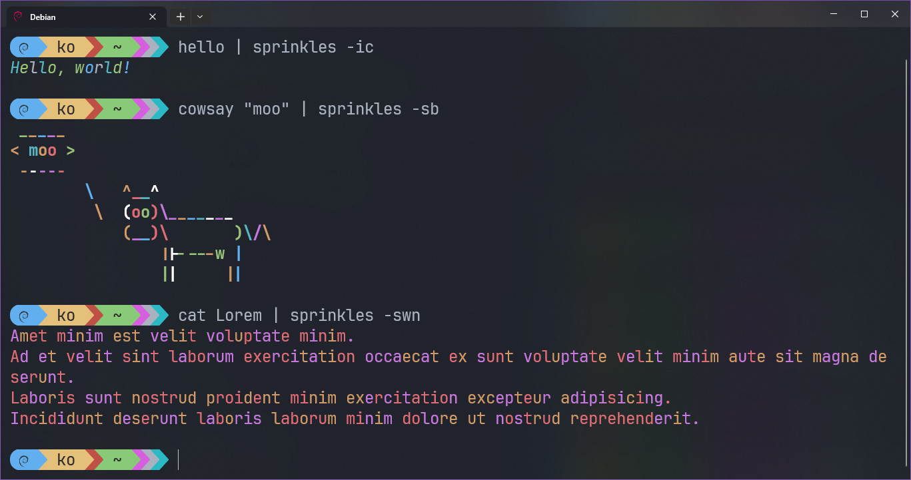

# sprinkles: add a dash of color

[](https://github.com/KhalilOuali/sprinkles/releases/tag/1.0.0) [](https://crates.io/crates/sprinkles)


# 🌈 Overview

Randomly colors input text and outputs it to the terminal.

# 💻 Examples



# ⌨ Usage

```
Usage: sprinkles [OPTIONS]

Options:
  -w, --warm      something warm
  -c, --cold      something refreshing
  -s, --shiny     a bit brighter
  -b, --bold      BIG sprinkles
  -i, --italic    slightly off
  -n, --no-white  only the good stuff
  -h, --help      Print help
  -V, --version   Print version
```

## 🙏 Special Thanks

* [termcolor](https://github.com/BurntSushi/termcolor): Cross platform terminal colors for Rust.
* [clap](https://github.com/clap-rs/clap): Command Line Argument Parser for Rust.
* Inspired by [cmatrix](https://github.com/abishekvashok/cmatrix) and other CLI toys.
